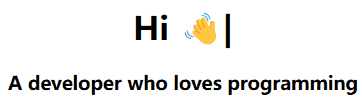

<h1 align="center">
  
</h1>

  

  
  
  
  
  

  

  

### 🚀 关于我

- 🔭 我目前正在研究 [您的项目名称]
- 🌱 我正在学习 [技术/框架名称]
- 👯 我希望能在 [领域/项目] 上进行合作
- 💬 欢迎向我咨询关于 [您的专长领域] 的问题

### 🛠 技能和工具

<!-- 

  
  
  
  
  
  
  
  
  
  

 -->

  
  
  
  
  
  
  
  
  
  
  
  
  
  
  
  
  
  
  
  
  
  
  
  
  
  
  
  
  
  
  
  
  
  

### 📊 GitHub 统计

  

### 📫 联系我

- Email：[kenisdsg1108@gmail.com](mailto:kenisdsg1108@gmail.com)
- My Blog：[kenis1108.github.io](https://kenis1108.github.io)

### ⚡ 有趣的事实

- [分享一个关于您的有趣事实]
